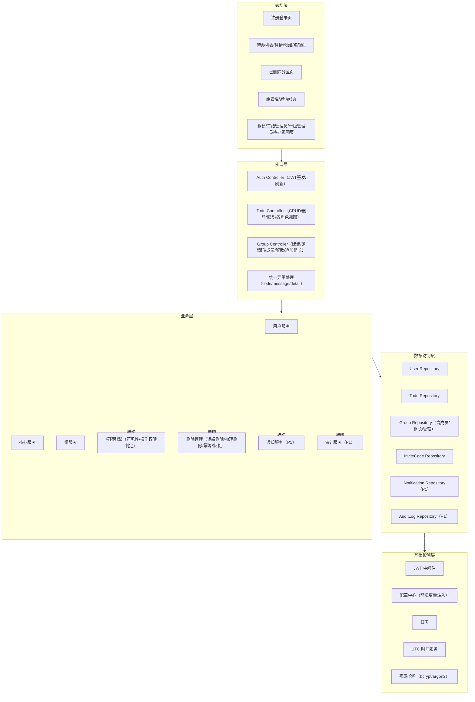
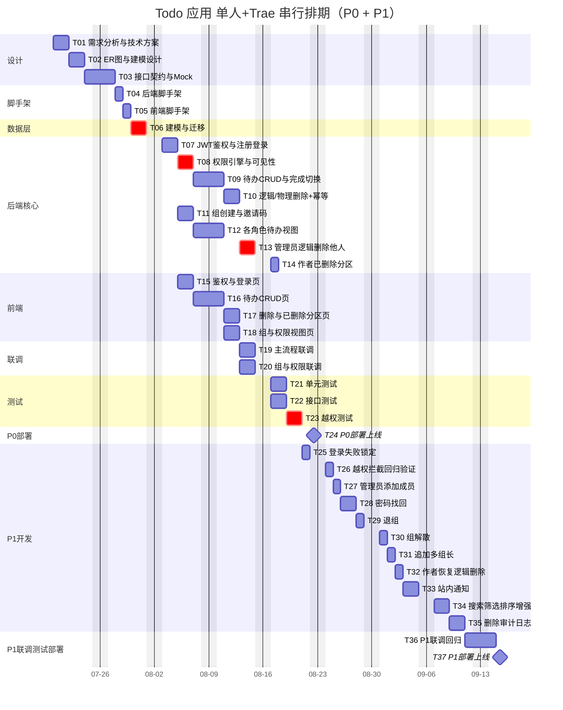

# Todo 待办事项应用 开发计划

> 版本：v1.0 ｜ 基于 PRD v1.1 ｜ 单人全栈 + Trae（AI 辅助）
> 输出路径：/Users/sunbao/Documents/workspace/trae/用法/project1/docs/开发计划.md
> 最后更新：2026-07-17

---

## 前置说明（澄清结论）

| 项 | 结论 |
| --- | --- |
| 权限角色层级 | **4 级**：普通用户 / 组长 / 二级管理员 / 一级管理员（不引入超级管理员，对齐 PRD 附录 A 与第 6.16 节） |
| P0 必覆盖功能点 | **F01-F16**（对齐 PRD 第 3.1 节，共 16 项 P0） |
| F18 含义 | **登录失败锁定**（P1，对齐 PRD 第 3.2 节） |
| F19 含义 | **越权拦截**（P1，独立功能点，详细规则见附录 B.1；F19 验收以附录 B 全场景覆盖为准） |
| 越权拦截测试覆盖范围 | 覆盖 **F19（越权拦截功能点）** + **附录 B 越权拦截规则** + **F15（管理员/组长逻辑删除他人待办）** + 所有涉及权限判定的功能点（F05/F06/F09/F12/F13/F14/F16） |
| F17-F27 | 列为 P1，按余量推进，P2（F28-F29）不纳入本次排期 |

---

## 一、技术方案概要

### 1. 模块划分



横切模块说明：
- **权限引擎**：所有待办相关接口（查看/修改/删除）均经权限引擎判定可见性与操作权限
- **删除管理**：统一处理逻辑删除/物理删除/幂等/作者恢复边界
- **通知/审计**：P1 横切，由删除管理、组服务触发

### 2. 数据模型设计要点

#### 2.1 多对多关系（显式建模）

| 关系 | 中间表 | 说明 |
| --- | --- | --- |
| 用户-组成员 | GroupMember | 一个用户可属多组，一组可有多个成员 |
| 用户-组长 | GroupLeader | 一个组可有多名组长（PRD 第 6.6 节） |
| 二级管理员-管辖组 | SecondaryAdminScope | 一个二级管理员可管辖多组 |

#### 2.2 核心实体字段清单（字段级，不写代码）

**User（用户）**
- id: BIGINT 主键自增
- email: VARCHAR(255) 唯一非空
- password_hash: VARCHAR(255) 非空（bcrypt/argon2 加盐）
- failed_login_count: INT 默认 0（P1 F18）
- locked_until: DATETIME NULL（UTC，P1 F18）
- is_active: BOOLEAN 默认 TRUE
- created_at / updated_at: DATETIME（UTC）

**Todo（待办）** —— 删除分级核心实体
- id: BIGINT 主键自增
- author_id: BIGINT 外键→User.id 非空
- title: VARCHAR(100) 非空
- description: VARCHAR(500) NULL
- due_at: DATETIME NULL（UTC）
- priority: VARCHAR(10) 非空（high/medium/low）
- status: VARCHAR(10) 非空（pending/done）
- **is_deleted**: BOOLEAN 默认 FALSE（逻辑删除标记）
- **deleted_by**: BIGINT 外键→User.id NULL（删除人，区分作者/管理员/组长）
- **deleted_at**: DATETIME NULL（UTC）
- created_at / updated_at: DATETIME（UTC）
- 索引：idx_todo_author_deleted (author_id, is_deleted, created_at DESC)、idx_todo_deleted (is_deleted, created_at)

**Group（组）**
- id: BIGINT 主键自增
- name: VARCHAR(50) 非空（不设唯一约束，PRD F10）
- description: VARCHAR(200) NULL
- is_dissolved: BOOLEAN 默认 FALSE（P1 F22）
- dissolved_at: DATETIME NULL
- created_by: BIGINT 外键→User.id
- created_at / updated_at: DATETIME（UTC）

**GroupMember（组成员，M:N）**
- id: BIGINT 主键
- group_id: BIGINT 外键→Group.id
- user_id: BIGINT 外键→User.id
- created_at: DATETIME
- 约束：UNIQUE(group_id, user_id)
- 索引：idx_gm_user(user_id)、idx_gm_group(group_id)

**GroupLeader（组长，M:N）**
- id: BIGINT 主键
- group_id: BIGINT 外键→Group.id
- user_id: BIGINT 外键→User.id
- created_at: DATETIME
- 约束：UNIQUE(group_id, user_id)
- 索引：idx_gl_user(user_id)、idx_gl_group(group_id)

**SecondaryAdminScope（二级管理员-管辖组，M:N）**
- id: BIGINT 主键
- admin_id: BIGINT 外键→User.id
- group_id: BIGINT 外键→Group.id
- created_at: DATETIME
- 约束：UNIQUE(admin_id, group_id)
- 索引：idx_sas_admin(admin_id)

**PlatformAdmin（一级管理员）**
- id: BIGINT 主键
- user_id: BIGINT 外键→User.id UNIQUE
- created_at: DATETIME

**InviteCode（邀请码）**
- id: BIGINT 主键
- group_id: BIGINT 外键→Group.id
- code: VARCHAR(32) 唯一非空
- created_by: BIGINT 外键→User.id
- expires_at: DATETIME（UTC）
- is_active: BOOLEAN 默认 TRUE
- created_at: DATETIME

**Notification（通知，P1）**
- id: BIGINT 主键
- user_id: BIGINT 外键→User.id
- event_type: VARCHAR(50)
- trigger_user_id: BIGINT 外键→User.id
- resource_type: VARCHAR(50)
- resource_id: BIGINT
- is_read: BOOLEAN 默认 FALSE
- created_at: DATETIME

**AuditLog（审计日志，P1）**
- id: BIGINT 主键
- operator_id: BIGINT 外键→User.id
- target_todo_id: BIGINT 外键→Todo.id
- action: VARCHAR(20)（logical_delete / physical_delete）
- ip: VARCHAR(45)
- created_at: DATETIME

#### 2.3 存储与迁移兼容约定
- 时间字段统一 **UTC + ISO8601** 存储与输出
- 外键**显式声明**，sqlite 启用 `PRAGMA foreign_keys=ON`
- 禁用 sqlite 专有类型（如 AUTOINCREMENT 特殊语义），主键统一 **BIGINT 自增**，保持 MySQL 迁移兼容
- 数据访问层抽象为 Repository/Manager，便于切换 MySQL

### 3. 权限引擎方案

#### 3.1 可见性判定规则（4 级，对齐 PRD 附录 A）

> 同一用户在不同组可兼任不同角色，角色按"用户-组"关系动态判定，不冲突。

```
visibility(user, todo) -> bool:
  1. 若 todo.author_id == user.id                    -> True  （作者始终可见自己待办，含被他人逻辑删除）
  2. 若 todo.is_deleted == True 且 user != author     -> False （他人不可见被逻辑删除的待办）
  3. 若 user 是一级管理员                               -> True
  4. 若 user 是 todo.author 所在组的组长（任一组长组）    -> True
  5. 若 user 是二级管理员且管辖 todo.author 所在组        -> True
  6. 其他                                              -> False
```

可见范围对照：
| 角色 | 可见他人待办范围 |
| --- | --- |
| 普通用户 | ✗（仅本人） |
| 组长 | 本组所有成员待办（跨其任组长的所有组聚合） |
| 二级管理员 | 管辖组所有成员待办 |
| 一级管理员 | 全平台所有用户待办 |

#### 3.2 操作权限判定（独立说明）

| 操作 | 普通用户 | 组长 | 二级管理员 | 一级管理员 |
| --- | --- | --- | --- | --- |
| 查看他人待办 | ✗ | ✓（本组范围） | ✓（管辖组范围） | ✓（全部） |
| **修改他人待办字段** | ✗ | **✗** | **✗** | **✗** |
| 逻辑删除他人待办 | ✗ | ✓（本组范围） | ✓（管辖组范围） | ✓（全部） |
| 物理删除待办 | 仅作者本人 | 仅作者本人 | 仅作者本人 | 仅作者本人 |
| 作者查看被他人逻辑删除的自己待办 | ✓（作者） | ✓（作者） | ✓（作者） | ✓（作者） |

> 关键边界：**管理员/组长对他人待办仅"查看 + 逻辑删除"，不可修改**（对齐 PRD 附录 A 与附录 B.1）。

### 4. 删除分级实现方案

#### 4.1 逻辑删除
- **字段**：is_deleted / deleted_by / deleted_at
- **幂等规则**：对已 `is_deleted=True` 的待办再次发起逻辑删除，返回 **200 + 当前状态**，不报错、不重复写入（PRD 附录 B.4）
- **作者对"被他人逻辑删除待办"的边界**：
  - 可查看（已删除分区，带 deleted_by / deleted_at）
  - **可修改字段**（PRD F06：作者对自己已被他人逻辑删除的待办仍可修改）
  - **不可恢复**（仅 `deleted_by == 作者本人` 的可恢复，见 P1 F24；他人删除的不可恢复，返回 403）

#### 4.2 物理删除
- 仅限**原作者本人**（对齐 PRD F09 与附录 A）
- 需**二次确认**
- 可对未逻辑删除或已逻辑删除的待办执行，均需二次确认
- 不可恢复，数据从库中真正删除

### 5. 接口契约约定

#### 5.1 REST 路由规范（节选，版本前缀 /api/v1）
- POST /auth/register（F01）
- POST /auth/login（F02）
- POST /auth/refresh（JWT 刷新）
- GET/POST /todos（F03/F04）
- GET/PATCH /todos/{id}（F05/F06；PATCH 仅作者）
- POST /todos/{id}/toggle-done（F07）
- POST /todos/{id}/logical-delete（F08/F15）
- POST /todos/{id}/physical-delete（F09，body 携带 confirm=true）
- POST /todos/{id}/restore（P1 F24）
- GET /todos/deleted（F16，作者已删除分区）
- GET /todos/group-members（F12，组长视图）
- GET /todos/managed-groups（F13，二级管理员视图）
- GET /todos/all（F14，一级管理员视图）
- POST/GET /groups（F10）
- POST /groups/{id}/invite-codes（F11）
- POST /groups/join（F11）

#### 5.2 统一错误格式
```json
{ "code": "PERMISSION_DENIED", "message": "无权访问", "detail": "资源不可见或无操作权限" }
```
- 越权统一返回 **403**，不泄露资源是否存在（附录 B.1）

#### 5.3 JWT 鉴权与刷新
- Access Token 有效期 ≤ 2h
- Refresh Token 有效期 ≤ 7d
- Header：`Authorization: Bearer <token>`
- 全站统一 JWT，不引入 Cookie/CSRF

#### 5.4 分页参数约定
- 入参：page（默认 1）、page_size（默认 20，最大 50）
- 出参：`{ "items": [], "total": 0, "page": 1, "page_size": 20 }`

### 6. 关键技术风险

| # | 风险 | 应对策略 |
| --- | --- | --- |
| R1 | 多对多关系下组长跨组聚合查询性能（任多组组长时聚合多组成员待办，JOIN 层级深） | GroupMember/GroupLeader 对 (user_id)/(group_id) 建索引；Todo 对 (author_id, is_deleted) 建复合索引；用 IN 子查询替代多层 JOIN；P95 ≤ 500ms 压测验证 |
| R2 | 退组后历史待办可见性实时判定的事务一致性（退组与并发查询竞态） | 退组与可见性判定同事务隔离级别 READ COMMITTED；退组先删 GroupMember 关系，可见性实时查关系表，不缓存快照（附录 B.2） |
| R3 | 逻辑删除幂等与作者恢复权限边界（deleted_by 判定错误致越权恢复；幂等并发写状态不一致） | 恢复接口校验 `deleted_by == author_id`；逻辑删除用乐观锁/SELECT FOR UPDATE 保证幂等；单元测试覆盖边界 |
| R4 | 单人 + AI 辅助下范围蔓延与质量保障风险（精力有限、AI 产出参差、越权漏洞易遗留） | 严格 P0/P1 边界；权限引擎独立模块 + 越权测试用例先行；AI 产出的 Mock/测试用例需人工串行验收 |
| R5 | sqlite → MySQL 迁移兼容性陷阱（隐式类型转换、AUTOINCREMENT 语义、外键默认不强制） | 禁用 sqlite 专有类型；主键统一 BIGINT；外键显式声明并启用 PRAGMA foreign_keys=ON；时间统一 UTC DATETIME；Repository 抽象隔离 ORM 细节 |

---

## 二、任务拆解（WBS）

> 阶段取值：设计 / 开发 / 联调 / 测试 / 部署
> 负责人角色统一：全栈(单人+Trae)
> 单任务 ≤ 2 人日；超 2 人日已拆分

### P0 任务（F01-F16 必覆盖）

| 任务ID | 任务名 | 模块 | 阶段 | 关联功能点 | 依赖任务 | 预估(人日) | 优先级 | 负责人角色 | 产出物 | 验收标准 |
| --- | --- | --- | --- | --- | --- | --- | --- | --- | --- | --- |
| T01 | 需求分析与技术方案细化 | 全局 | 设计 | F01-F16 | - | 1.5 | P0 | 全栈(单人+Trae) | 技术方案文档 | 方案覆盖权限引擎/删除分级/接口契约/数据模型，无遗漏 F01-F16 |
| T02 | 数据库 ER 图与建模设计 | 数据层 | 设计 | F01-F16 | T01 | 1.5 | P0 | 全栈(单人+Trae) | ER 图/建模文档 | 含 3 个 M:N 关系、删除分级字段、索引策略、MySQL 兼容约定 |
| T03 | 接口契约定义与前后端 Mock | 接口层 | 设计 | F01-F16 | T01 | 2 | P0 | 全栈(单人+Trae) | OpenAPI 文档/Mock Server | 路由/统一错误格式/JWT/分页约定齐全，前端可基于 Mock 联调 |
| T04 | 后端工程脚手架与配置环境变量化 | 基础设施 | 开发 | - | T01 | 1 | P0 | 全栈(单人+Trae) | Django 工程/配置文件 | settings 环境变量化（DB/JWT/邀请码有效期），工程可启动 |
| T05 | 前端工程脚手架 | 基础设施 | 开发 | - | T01 | 1 | P0 | 全栈(单人+Trae) | Vite 工程/路由骨架 | React+TS+Vite 跑通，路由骨架就绪 |
| T06 | 数据库建模与迁移脚本 | 数据层 | 开发 | F01-F16 | T02,T04 | 2 | P0 | 全栈(单人+Trae) | Django models/migrations | M:N 表/外键/索引/删除字段就绪，migrate 通过，PRAGMA foreign_keys=ON |
| T07 | JWT 鉴权与用户注册登录 | 接口层/业务层 | 开发 | F01,F02 | T06 | 2 | P0 | 全栈(单人+Trae) | 鉴权模块代码 | F01/F02 接口通过；密码加盐哈希；JWT 签发≤2h + 刷新≤7d；重复邮箱 409；密码错误 401 |
| T08 | 权限引擎与可见性判定模块 | 业务层 | 开发 | F05,F12,F13,F14,F15 | T06 | 2 | P0 | 全栈(单人+Trae) | 权限引擎代码 | 4 级角色可见性判定单元测试 100% 通过；含作者/组长/二级/一级全场景 |
| T09 | 待办 CRUD 与完成状态切换（作者） | 业务层 | 开发 | F03,F04,F06,F07 | T07,T08 | 2 | P0 | 全栈(单人+Trae) | 待办服务代码 | F03/F04/F06/F07 接口通过；标题校验 1-100；分页默认 20 最大 50；非作者改 403；作者对被他人逻辑删除待办仍可改 |
| T10 | 待办逻辑删除与物理删除（作者）+ 幂等 | 业务层 | 开发 | F08,F09 | T09 | 1.5 | P0 | 全栈(单人+Trae) | 删除管理代码 | F08/F09 通过；物理删除二次确认；逻辑删除幂等返回 200；非作者物理删除 403 |
| T11 | 组创建与邀请码入组 | 业务层 | 开发 | F10,F11 | T07 | 1.5 | P0 | 全栈(单人+Trae) | 组服务代码 | F10/F11 通过；建组者自动成组长；邀请码可复用/过期/停用；已在组 409 |
| T12 | 组长/二级管理员/一级管理员待办视图 | 业务层 | 开发 | F12,F13,F14 | T08,T11 | 2 | P0 | 全栈(单人+Trae) | 聚合查询代码 | F12/F13/F14 跨组聚合返回正确；非对应角色 403；按用户/组筛选生效 |
| T13 | 管理员/组长逻辑删除他人待办 + 幂等 | 业务层 | 开发 | F15 | T08,T10 | 1.5 | P0 | 全栈(单人+Trae) | 删除管理代码 | F15 通过；越权（不在可见范围）403；已逻辑删除再删幂等返回 200+当前状态 |
| T14 | 作者已删除分区视图（被他人逻辑删除可见） | 业务层/表现层 | 开发 | F16 | T10,T13 | 1 | P0 | 全栈(单人+Trae) | 已删除视图接口 | F16 通过；列出 is_deleted=True 本人待办，带 deleted_by/deleted_at；他人无此视图 |
| T15 | 前端鉴权与注册登录页 | 表现层 | 开发 | F01,F02 | T03,T05,T07 | 1.5 | P0 | 全栈(单人+Trae) | 前端页面代码 | 注册/登录页可用；JWT 存储；错误提示友好 |
| T16 | 前端待办列表/详情/创建/编辑页 | 表现层 | 开发 | F03,F04,F05,F06,F07 | T15,T09 | 2 | P0 | 全栈(单人+Trae) | 前端页面代码 | 待办 CRUD 页面可用；分页/筛选/排序生效；非作者编辑禁用 |
| T17 | 前端删除操作与已删除分区页 | 表现层 | 开发 | F08,F09,F16 | T16,T14 | 1.5 | P0 | 全栈(单人+Trae) | 前端页面代码 | 逻辑/物理删除+二次确认+已删除分区可用；展示删除人/时间 |
| T18 | 前端组与权限视图（组长/管理员视图） | 表现层 | 开发 | F10,F11,F12,F13,F14,F15 | T16,T12,T13 | 2 | P0 | 全栈(单人+Trae) | 前端页面代码 | 组管理/邀请码/各角色待办视图可用；管理员逻辑删除他人待办入口 |
| T19 | P0 前后端联调（待办主流程） | 全局 | 联调 | F01-F09 | T09,T10,T16,T17 | 1.5 | P0 | 全栈(单人+Trae) | 联调报告 | 注册登录→创建→列表→修改→完成→逻辑/物理删除 端到端通过 |
| T20 | P0 前后端联调（组与权限流程） | 全局 | 联调 | F10-F16 | T11,T12,T13,T14,T18 | 1.5 | P0 | 全栈(单人+Trae) | 联调报告 | 建组→邀请码入组→各角色视图→管理员逻辑删除他人→作者已删除分区 端到端通过 |
| T21 | 单元测试（权限引擎/删除管理） | 全局 | 测试 | F05,F06,F08,F09,F12,F13,F14,F15,F16 | T08,T10,T13 | 2 | P0 | 全栈(单人+Trae) | 测试用例代码 | 覆盖率≥80%；权限引擎 4 级角色边界用例齐全；删除幂等用例齐全 |
| T22 | 接口测试（F01-F16 全功能点） | 全局 | 测试 | F01-F16 | T19,T20 | 2 | P0 | 全栈(单人+Trae) | 接口测试用例 | F01-F16 接口用例 100% 通过；含异常分支（400/401/403/409） |
| T23 | 权限边界越权测试（覆盖附录 B + F15） | 全局 | 测试 | F05,F06,F09,F12,F13,F14,F15,F16 | T21,T22 | 2 | P0 | 全栈(单人+Trae) | 越权测试用例 | 附录 B 越权场景 100% 拦截返回 403；管理员/组长修改他人待办 403；非作者物理删除 403；越权不泄露资源存在性 |
| T24 | P0 部署与上线 | 基础设施 | 部署 | F01-F16 | T22,T23 | 1 | P0 | 全栈(单人+Trae) | 部署脚本 | P0 线上可用；环境变量配置生效；F01-F16 线上冒烟通过 |

**P0 功能点覆盖核对**：F01(T07/T15) F02(T07/T15) F03(T09/T16) F04(T09/T16) F05(T09/T16) F06(T09/T16) F07(T09/T16) F08(T10/T17) F09(T10/T17) F10(T11/T18) F11(T11/T18) F12(T12/T18) F13(T12/T18) F14(T12/T18) F15(T13/T18) F16(T14/T17) —— **16 项 100% 覆盖**。

**P0 非功能任务覆盖核对**：环境脚手架(T04/T05) ✓ ｜ 数据库建模迁移(T06) ✓ ｜ 权限引擎独立任务(T08) ✓ ｜ 接口契约与 Mock(T03) ✓ ｜ 单元/接口/越权测试(T21/T22/T23) ✓ ｜ 联调回归(T19/T20) ✓ ｜ 部署上线(T24) ✓

**P0 工时合计**：1.5+1.5+2+1+1+2+2+2+2+1.5+1.5+2+1.5+1+1.5+2+1.5+2+1.5+1.5+2+2+2+1 = **39.5 人日**

### P1 任务（按余量推进）

| 任务ID | 任务名 | 模块 | 阶段 | 关联功能点 | 依赖任务 | 预估(人日) | 优先级 | 负责人角色 | 产出物 | 验收标准 |
| --- | --- | --- | --- | --- | --- | --- | --- | --- | --- | --- |
| T25 | 登录失败锁定 | 业务层 | 开发 | F18 | T07 | 1 | P1 | 全栈(单人+Trae) | 锁定模块代码 | 连续 5 次失败锁定 5 分钟；锁定期内登录 403+剩余时间；期满自动解除 |
| T26 | 越权拦截回归验证（F19） | 全局 | 测试 | F19 | T23 | 1 | P1 | 全栈(单人+Trae) | 越权回归用例 | 附录 B.1 全场景 100% 拦截返回 403；响应体不泄露资源存在性；管理员/组长修改他人待办 403；二级管理员越权解散/追加组长/添加成员 403 |
| T27 | 管理员直接添加成员 | 业务层 | 开发 | F17 | T11 | 1 | P1 | 全栈(单人+Trae) | 组服务代码 | 组长/一级管理员添加成员成功；用户不存在 404；已在组 409；二级管理员 403 |
| T28 | 密码找回 | 业务层 | 开发 | F20 | T07 | 1.5 | P1 | 全栈(单人+Trae) | 密码重置代码 | token 单次有效且 15 分钟过期；新密码满足复杂度；旧密码登录失效 |
| T29 | 退组 | 业务层 | 开发 | F21 | T11 | 1 | P1 | 全栈(单人+Trae) | 组服务代码 | 退组解除成员关系；历史待办对原组不可见；组长退组需先转让/追加新组长否则 400 |
| T30 | 组解散 | 业务层 | 开发 | F22 | T11 | 1 | P1 | 全栈(单人+Trae) | 组服务代码 | 解散解除所有关系；二次确认；二级管理员 403；多组长互不阻塞 |
| T31 | 追加多组长 | 业务层 | 开发 | F23 | T11 | 1 | P1 | 全栈(单人+Trae) | 组服务代码 | 一组可多名组长；非成员先入组再提升；二级管理员 403；任一组长独立追加 |
| T32 | 作者恢复自己逻辑删除的待办 | 业务层 | 开发 | F24 | T10 | 1 | P1 | 全栈(单人+Trae) | 删除管理代码 | 恢复 deleted_by==作者 的待办成功；恢复他人删除的返回 403 |
| T33 | 站内通知 | 业务层 | 开发 | F25 | T11,T13 | 2 | P1 | 全栈(单人+Trae) | 通知模块代码 | 关键事件触发通知；已读/未读；未读数角标 |
| T34 | 待办搜索/筛选/排序增强 | 业务层/表现层 | 开发 | F26 | T09,T16 | 1.5 | P1 | 全栈(单人+Trae) | 检索代码 | 标题模糊匹配（LIKE）；筛选/排序组合生效；空结果友好提示 |
| T35 | 删除操作审计日志 | 业务层 | 开发 | F27 | T10,T13 | 1.5 | P1 | 全栈(单人+Trae) | 审计模块代码 | 记录操作人/目标/类型/时间/IP；一级管理员可查；普通用户不可见 |
| T36 | P1 联调与回归测试（含越权回归） | 全局 | 联调/测试 | F17-F27 | T25-T35 | 2 | P1 | 全栈(单人+Trae) | 联调/测试报告 | F17-F27 端到端通过；越权回归无回归；P0 功能无回归 |
| T37 | P1 部署上线 | 基础设施 | 部署 | F17-F27 | T36 | 1 | P1 | 全栈(单人+Trae) | 部署脚本 | P1 线上可用；F17-F27 冒烟通过 |

**P1 工时合计**：1+1+1+1.5+1+1+1+1+2+1.5+1.5+2+1 = **16.5 人日**

### 总工时与日历周期
- P0：39.5 人日 ≈ **40 工作日**（约 8 个日历周）
- P1：16.5 人日 ≈ **17 工作日**（约 3.4 个日历周）
- **总计：56 人日 ≈ 57 工作日 ≈ 11.4 个日历周**（按 5 工作日/周，可在 2 周基础上延长至约 12 周）
- 与单人全职配置自洽：单人串行，无并行人力冗余

---

## 三、开发顺序建议

> 排期起点：2026-07-20（周一），按 5 工作日/周，周末（周六/周日）在甘特图中自动标灰不排任务。

### 1. 单人串行排期甘特图（按工作日粒度）



### 2. 任务依赖关系图（标注关键路径）

> 红色加粗节点为关键路径（critical path）上的任务，决定 P0 最早完工时间。

```mermaid
flowchart LR
    T01[T01 需求分析]:::crit --> T02[T02 ER图建模]:::crit
    T01 --> T03[T03 接口契约Mock]
    T02 --> T06[T06 建模与迁移]:::crit
    T03 --> T04[T04 后端脚手架]
    T04 --> T05[T05 前端脚手架]
    T05 --> T06
    T06 --> T07[T07 JWT鉴权注册登录]:::crit
    T06 --> T08[T08 权限引擎]:::crit
    T07 --> T09[T09 待办CRUD]:::crit
    T07 --> T11[T11 组创建邀请码]
    T08 --> T12[T12 各角色视图]
    T08 --> T09
    T09 --> T10[T10 逻辑/物理删除]:::crit
    T10 --> T13[T13 管理员逻辑删除他人]:::crit
    T10 --> T14[T14 已删除分区]:::crit
    T13 --> T14
    T13 --> T21[T21 单元测试]
    T03 --> T15[T15 前端鉴权页]
    T07 --> T15
    T15 --> T16[T16 待办CRUD页]
    T16 --> T17[T17 删除与已删除分区页]:::crit
    T14 --> T17
    T16 --> T18[T18 组与权限视图页]
    T12 --> T18
    T13 --> T18
    T10 --> T19[T19 主流程联调]:::crit
    T17 --> T19
    T18 --> T20[T20 组与权限联调]
    T19 --> T22[T22 接口测试]:::crit
    T20 --> T22
    T21 --> T23[T23 越权测试]:::crit
    T22 --> T23
    T23 --> T24[T24 P0部署]:::crit
    T23 --> T25[T25 登录失败锁定]
    T25 --> T26[T26 越权拦截回归]
    T26 --> T27[T27 管理员添加成员]
    T27 --> T28[T28 密码找回]
    T28 --> T29[T29 退组]
    T29 --> T30[T30 组解散]
    T30 --> T31[T31 追加多组长]
    T31 --> T32[T32 作者恢复逻辑删除]
    T32 --> T33[T33 站内通知]
    T33 --> T34[T34 搜索筛选增强]
    T34 --> T35[T35 删除审计日志]
    T35 --> T36[T36 P1联调回归]
    T36 --> T37[T37 P1部署]

    classDef crit fill:#ffcccc,stroke:#cc0000,stroke-width:2px,font-weight:bold;
```



**关键路径（P0）**：T01 → T02 → T06 → T07 → T09 → T10 → T13 → T14 → T17 → T19 → T22 → T23 → T24
- 依赖链长度约 21.5 人日；单人串行实际占用约 40 工作日（含并行分支任务串行执行）
- 关键路径上任一任务延期即影响 P0 上线时间，需优先保障

### 3. 里程碑节点

| 里程碑 | 含义 | 对应任务完成 | 预计达成日期 |
| --- | --- | --- | --- |
| **M1** | 工程骨架与数据模型就绪 | T04/T05/T06 完成 | 2026-07-31 |
| **M2** | P0 后端权限引擎完成 | T08 + T13 完成 | 2026-08-20 |
| **M3** | P0 前端联调通过 | T19 + T20 完成 | 2026-09-08 |
| **M4** | P0 全功能验收 + 越权测试通过 | T22 + T23 完成 | 2026-09-16 |
| **M5** | P1 增强交付（按余量） | T36 完成 | 2026-10-13 |
| **M6** | 部署上线 | T24（P0）/ T37（P1） | P0: 2026-09-17 ｜ P1: 2026-10-14 |

### 4. 单人场景下"并行"说明

单人无真正人力并行，"并行"主要体现在 **Trae 辅助产出非关键路径产物**，人工聚焦关键路径串行验收。

#### 可借助 Trae 并行产出素材（AI 产出，人工验收）
- **T03 Mock Server / OpenAPI 文档初稿**：Trae 基于接口契约生成 Mock，前端可提前联调
- **T21/T22/T23 测试用例初稿**：Trae 基于权限矩阵与附录 B 生成越权测试用例骨架，人工补全边界
- **T15-T18 前端组件脚手架**：Trae 生成列表/表单/弹窗等通用组件代码，人工组装
- **T02 ER 图初稿 / T06 models 代码骨架**：Trae 基于字段清单生成 Django models 骨架，人工校对索引与外键
- **T33 通知模板 / T35 审计字段**：Trae 生成模板代码

#### 必须人工串行验收（不可委托 AI 自主完成）
- **T08 权限引擎与可见性判定**：PRD 最难点，4 级角色边界必须人工设计与验证
- **T10/T13 删除管理与幂等/作者恢复边界**：deleted_by 判定与幂等并发必须人工把关
- **T19/T20 前后端联调**：端到端一致性必须人工验证
- **T23 越权测试用例审定与执行**：AI 产出的越权用例必须人工逐条核对是否符合附录 B，并实际执行
- **T24/T37 部署上线**：环境变量、迁移、冒烟必须人工确认

#### 质量保障红线
1. 权限引擎（T08）单元测试先行，越权测试（T23）为 P0 必过门槛
2. 所有 AI 产出的代码/用例须经人工 review 后方可合入
3. 任何范围蔓延（如临时新增 P2 功能）需显式评估对关键路径的影响

---

## 附录：与 PRD 的对齐核对

| PRD 要求 | 开发计划对应 |
| --- | --- |
| 4 级角色（不含超级管理员） | 前置说明 + 权限引擎 3.1 节 |
| P0 = F01-F16 | WBS P0 任务 + 覆盖核对 |
| P1 = F17-F27（含 F19 越权拦截） | WBS P1 任务 T25-T37 |
| F19 越权拦截（独立功能点，附录 B.1） | T23 P0 越权测试 + T26 P1 越权拦截回归验证 |
| 删除分级（逻辑/物理）+ 幂等 | 技术方案 4 节 + T10/T13/T14/T32 |
| 管理员/组长对他人待办仅查看+逻辑删除，不可修改 | 权限引擎 3.2 节 + T23/T26 越权测试 |
| UTC + ISO8601 + 外键显式 + MySQL 迁移预留 | 数据模型 2.3 节 + 风险 R5 |
| JWT ≤2h / 刷新 ≤7d | 接口契约 5.3 节 + T07 |
| 分页默认 20 最大 50 | 接口契约 5.4 节 + T09/T12 |
| 统一错误格式 {code,message,detail} | 接口契约 5.2 节 |
| 附录 B 越权拦截 403 不泄露资源 | T23 + T26 验收标准 |
| 退组后可见性实时判定 | 风险 R2 + T29 |
