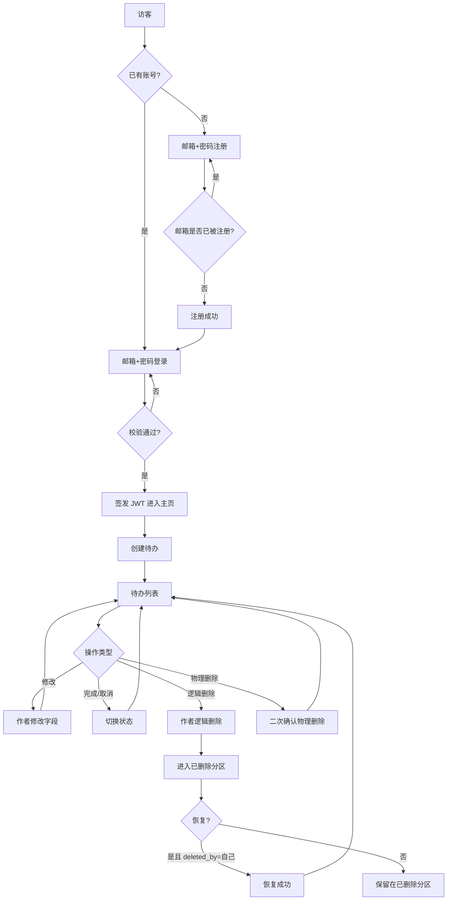
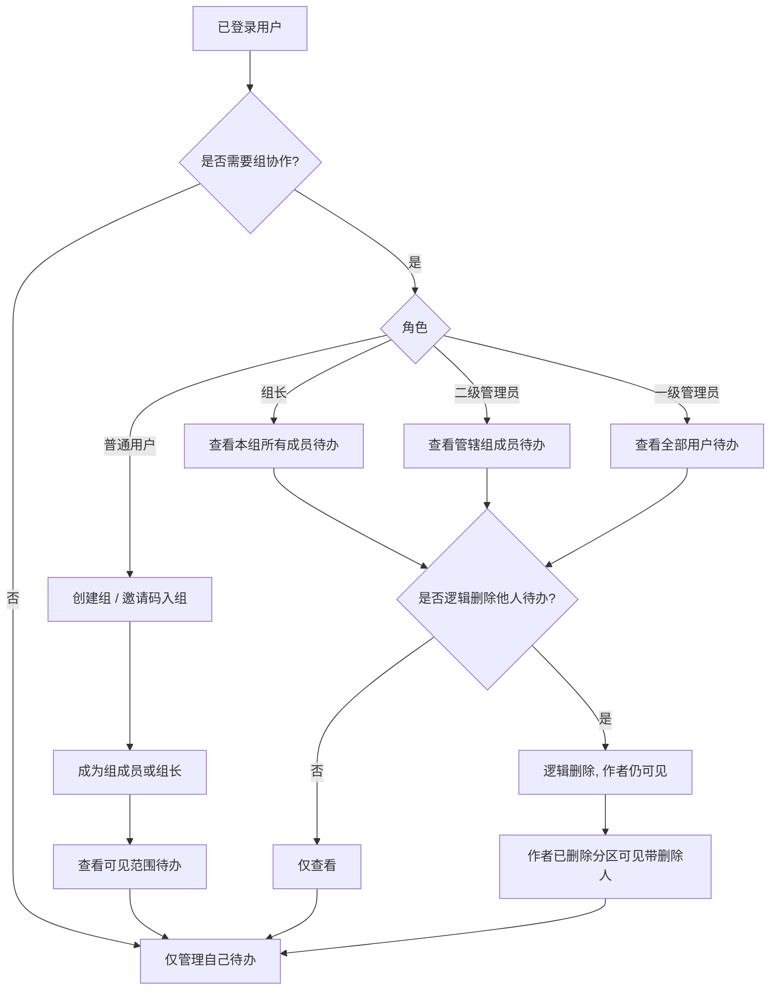
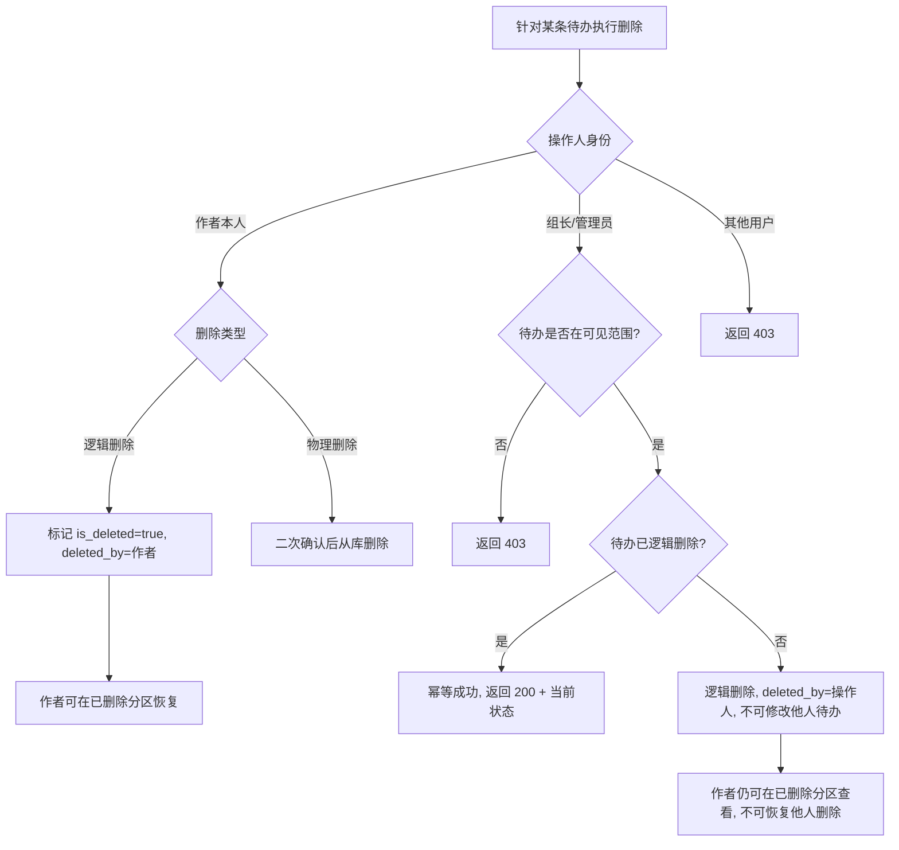

# Todo 待办事项应用 PRD

> 版本：v1.1 ｜ 阶段：从零立项（MVP + 轻量权限）
> 技术栈：后端 Python + Django；前端 React + TypeScript + Vite；数据库 sqlite3（预留 MySQL 迁移兼容性）
> 最后更新：2026-07-17

---

## 1. 背景与目标

### 1.1 背景
现有待办类应用普遍功能臃肿、广告干扰多，个人用户在管理日常待办时心智负担过重；同时，小型团队/小组在协作时缺乏轻量的权限可见性控制，要么完全公开要么完全隔离，难以满足"组内可见、组间隔离"的协同需求。

### 1.2 目标
构建一个最小可用的 Todo 应用，在保持工具简洁、无广告的前提下，提供：
1. 用户注册与登录（邮箱+密码，JWT）
2. 待办事项的增删改查与完成状态切换
3. 多用户、多组的轻量权限管理（普通用户 / 组长 / 二级管理员 / 一级管理员，共 4 类角色）

### 1.3 目标用户
个人用户为主，存在多用户、多组的协同管理场景（如学习小组、小型项目组）。

### 1.4 关键设计原则
- **最小可用优先**：核心待办能力与基础权限先行，非核心能力后置
- **数据归属与可见性分离**：待办始终归属作者本人，可见性由"用户-组"关系动态推导
- **删除分级**：物理删除仅限原作者；管理员/组长仅逻辑删除；作者仍可查看被他人逻辑删除的数据
- **鉴权统一**：全站采用 JWT 模式，不引入 Cookie/CSRF 模式
- **MySQL 迁移预留**：时间字段统一 UTC + ISO8601/DATETIME 存储；外键显式声明；不使用 sqlite 专有类型

---

## 2. 名词解释

| 术语 | 含义 |
| --- | --- |
| 逻辑删除 | 将待办的 `is_deleted` 标记为 true，并记录 `deleted_by`/`deleted_at`，数据仍在库中；列表默认不展示，但作者仍可在"已删除"分区查看 |
| 物理删除 | 将待办从数据库中真正删除，不可恢复；仅限原作者对自己的待办操作，需二次确认 |
| 邀请码 | 组长生成的入组凭证，在有效期内可被多人复用入组，直至过期或组长停用（非一次性） |
| 组长 | 组的管理者，可查看本组所有成员待办，可逻辑删除本组成员待办；一个组可有多名组长 |
| 二级管理员 | 平台级角色，被一级管理员分配管辖一个或多个组，可查看管辖组成员待办并逻辑删除 |
| 一级管理员 | 平台级角色，可查看全部用户待办并逻辑删除，可解散任意组、追加任意组组长、分配二级管理员管辖组 |
| 可见范围 | 某用户能查看的待办集合，由"作者身份 + 用户-组关系 + 角色"动态推导，不保留历史快照 |
| 幂等删除 | 对已逻辑删除的待办再次发起逻辑删除时，返回 200 + 当前状态，不报错、不重复写入 |

---

## 3. 功能列表

> 共 29 个功能点，按 P0 / P1 / P2 排序。
> 验收标准统一含：**前置条件 / 操作步骤 / 预期结果** 三要素。
> 越权拦截作为独立功能点 F19，详细规则见附录 B。

### 3.1 P0 功能（MVP 必做，16 项）

| 编号 | 功能点 | 优先级 | 描述 | 验收标准 |
| --- | --- | --- | --- | --- |
| F01 | 用户注册 | P0 | 邮箱+密码注册，密码长度≥8 且含字母+数字 | **前置**：邮箱未被注册  **操作**：填写邮箱、密码、确认密码并提交  **预期**：账号创建成功，返回用户 ID；密码加盐哈希存储；重复邮箱注册返回 409 |
| F02 | 用户登录 | P0 | 邮箱+密码登录，校验通过签发 JWT | **前置**：账号已注册且未被封禁  **操作**：输入邮箱、密码登录  **预期**：校验通过签发 JWT（有效期≤2h）并返回；密码错误返回 401；登录失败锁定策略见 F18 |
| F03 | 待办创建 | P0 | 创建归属当前用户的待办，含标题、描述、截止时间、优先级（高/中/低） | **前置**：已登录  **操作**：提交标题（必填，1-100 字）、描述（选填，≤500 字）、截止时间、优先级  **预期**：创建成功，状态为"未完成"；标题为空或超长返回 400 |
| F04 | 待办列表查看（自己） | P0 | 普通用户查看自己创建的待办，分页返回 | **前置**：已登录  **操作**：请求自己的待办列表  **预期**：仅返回 is_deleted=false 的本人待办；支持按状态筛选+按创建时间倒序；默认每页 20 条，最大 50 条 |
| F05 | 待办详情查看 | P0 | 查看单条待办详情 | **前置**：已登录且待办存在  **操作**：请求指定待办 ID  **预期**：本人待办返回完整字段；他人未删除待办按权限可见性返回；不可见返回 403 |
| F06 | 待办修改（作者） | P0 | 作者修改自己待办的字段 | **前置**：已登录且为该待办作者，待办未被物理删除  **操作**：修改标题/描述/截止时间/优先级  **预期**：更新成功，记录 updated_at；非作者请求修改返回 403；作者对自己已被他人逻辑删除的待办仍可修改字段 |
| F07 | 待办完成状态切换 | P0 | 作者在未完成/已完成间切换 | **前置**：已登录且为作者  **操作**：切换状态  **预期**：状态翻转成功，记录 updated_at；非作者返回 403 |
| F08 | 待办逻辑删除（作者） | P0 | 作者对自己的待办执行逻辑删除 | **前置**：已登录且为作者  **操作**：执行逻辑删除  **预期**：is_deleted=true，deleted_by=作者，记录 deleted_at；列表默认不展示；作者本人逻辑删除的可由作者恢复（见 F24） |
| F09 | 待办物理删除（作者） | P0 | 作者物理删除自己的待办，需二次确认 | **前置**：已登录且为作者  **操作**：对未逻辑删除或已逻辑删除的待办发起物理删除并二次确认  **预期**：数据从库中删除且不可恢复；二次确认未通过则不执行；非作者返回 403。说明：作者可直接物理删除未逻辑删除的待办，也可物理删除已逻辑删除的待办，二者均需二次确认 |
| F10 | 组创建 | P0 | 任意登录用户可建组，建组者自动成为组长 | **前置**：已登录  **操作**：提交组名称（必填，1-50 字）、描述（选填，≤200 字）  **预期**：组创建成功，创建者在"用户-组"关系中角色为组长，记录 created_at；重名不做唯一约束但提示确认 |
| F11 | 邀请码入组 | P0 | 组长生成邀请码，用户凭码入组为普通成员 | **前置**：组长已生成有效邀请码  **操作**：用户输入邀请码  **预期**：码有效且未过期则加入该组为普通成员；码无效/过期/已停用返回 400；已在组中返回 409。邀请码在有效期内可被多人复用入组，非一次性 |
| F12 | 组长查看本组成员待办 | P0 | 组长可查看其任组长的所有组的成员待办 | **前置**：用户为至少一个组的组长  **操作**：请求"本组成员待办"视图  **预期**：返回其任组长的所有组中成员（非删除态）的待办；跨组聚合；非组长角色请求返回 403 |
| F13 | 二级管理员查看管辖组待办 | P0 | 二级管理员查看被分配的多个组的成员待办 | **前置**：用户为二级管理员且已分配管辖组  **操作**：请求"管辖组待办"视图  **预期**：返回分配组中成员（非删除态）的待办；未被分配的组数据不可见；越权访问返回 403 |
| F14 | 一级管理员查看全部待办 | P0 | 一级管理员可查看全平台所有用户的待办 | **前置**：用户为一级管理员  **操作**：请求"全部待办"视图  **预期**：返回所有非删除态待办，支持按用户/组筛选；非一级管理员请求返回 403 |
| F15 | 管理员/组长逻辑删除他人待办 | P0 | 一级/二级管理员、组长可逻辑删除可见范围内他人待办 | **前置**：操作人为管理员或组长，目标待办在其可见范围  **操作**：执行逻辑删除  **预期**：is_deleted=true，deleted_by=操作人，记录 deleted_at；越权（不在可见范围）返回 403；对已逻辑删除的待办再次删除按幂等成功处理，返回 200 + 当前状态 |
| F16 | 作者查看被他人逻辑删除的待办 | P0 | 作者可在"已删除"分区查看被管理员/组长逻辑删除的待办，并带删除人与删除时间 | **前置**：作者登录，存在被他人逻辑删除的本人待办  **操作**：进入"已删除"分区  **预期**：列出 is_deleted=true 的本人待办，展示 deleted_by、deleted_at；作者本人逻辑删除的也在此分区；其他用户无此分区视图 |

### 3.2 P1 功能（增强，11 项）

| 编号 | 功能点 | 优先级 | 描述 | 验收标准 |
| --- | --- | --- | --- | --- |
| F17 | 管理员直接添加成员 | P1 | 一级管理员/组长直接将用户加入指定组 | **前置**：操作人为组长或一级管理员  **操作**：指定组 ID + 用户 ID 添加  **预期**：加入成功为普通成员；用户不存在返回 404；已在组返回 409；二级管理员无此权限返回 403 |
| F18 | 登录失败锁定 | P1 | 连续登录失败锁定账号 | **前置**：账号已注册  **操作**：连续输错密码  **预期**：连续 5 次失败锁定账号 5 分钟，锁定期内登录返回 403 并提示剩余时间；锁定期满自动解除 |
| F19 | 越权拦截 | P1 | 对所有不可见或无权限的写操作统一拦截返回 403，不泄露资源是否存在 | **前置**：用户已登录但目标资源不可见或无操作权限  **操作**：发起越权请求（修改他人待办、物理删除他人待办、访问不可见待办、管理员/组长修改他人待办、作者恢复他人删除的待办、二级管理员越权解散/追加组长/添加成员等）  **预期**：统一返回 403；响应体不泄露资源是否存在；附录 B 列举的全部越权场景 100% 拦截；管理员/组长对他人待办仅允许"查看 + 逻辑删除"，其他写操作一律拦截 |
| F20 | 密码找回 | P1 | 通过邮箱重置密码 | **前置**：账号绑定有效邮箱  **操作**：申请重置→邮箱收到一次性 token→凭 token 设置新密码  **预期**：token 单次有效且 15 分钟过期；新密码需满足复杂度；旧密码登录失效 |
| F21 | 退组 | P1 | 用户主动退出已加入的组 | **前置**：用户为该组成员  **操作**：发起退组  **预期**：解除成员关系；退组后其在组期间创建的历史待办对原组其他成员不再可见（权限随成员关系实时判定），但作者本人的"我的待办"视图不受影响；组长退组需先转让或追加新组长，否则返回 400 |
| F22 | 组解散 | P1 | 组长/一级管理员解散组 | **前置**：操作人为该组组长或一级管理员  **操作**：发起解散并二次确认  **预期**：解除所有成员关系与组长关系，组标记为已解散；待办本身不删除，可见性按解散后新成员关系判定；二级管理员无此权限返回 403。多组长场景下任一组长可独立发起解散，互不阻塞 |
| F23 | 追加多组长 | P1 | 一级管理员/组长为组追加额外组长 | **前置**：操作人为该组组长或一级管理员  **操作**：指定组与已有成员，提升为组长  **预期**：一个组可有多名组长；非成员不能直接提为组长（先入组再提升）；二级管理员无此权限返回 403；任一组长可独立追加新组长，互不阻塞 |
| F24 | 作者恢复自己逻辑删除的待办 | P1 | 作者恢复"自己逻辑删除"的待办，不可恢复他人删除的 | **前置**：待办 is_deleted=true 且 deleted_by=作者本人  **操作**：发起恢复  **预期**：is_deleted=false，清空 deleted_by/deleted_at；恢复 deleted_by≠作者 的待办返回 403 |
| F25 | 站内通知 | P1 | 关键事件站内通知 | **前置**：用户已登录  **操作**：触发事件（被加入组、待办被他人逻辑删除、被设为组长/管理员）  **预期**：相关用户收到站内通知，含事件类型/触发人/时间/关联资源；通知列表支持已读/未读；未读数角标 |
| F26 | 待办搜索/筛选/排序增强 | P1 | 在 P0 基础上增强检索能力 | **前置**：已登录  **操作**：按标题模糊搜索、按截止时间/优先级筛选与排序  **预期**：搜索支持标题模糊匹配（不索引，LIKE 实现）；筛选/排序组合生效；空结果友好提示 |
| F27 | 删除操作审计日志 | P1 | 记录所有逻辑/物理删除操作 | **前置**：审计开关开启  **操作**：任意用户执行删除  **预期**：记录操作人/目标待办 ID/操作类型（逻辑/物理）/时间/IP；一级管理员可查看审计列表；普通用户不可见 |

### 3.3 P2 功能（远期，2 项）

| 编号 | 功能点 | 优先级 | 描述 | 验收标准 |
| --- | --- | --- | --- | --- |
| F28 | 邮件通知 | P2 | 关键事件邮件渠道通知 | **前置**：用户邮箱已验证（本期不做验证，默认可发）  **操作**：触发事件  **预期**：异步发送邮件；发送失败不阻塞主流程并记录重试；用户可在设置中关闭 |
| F29 | 响应式移动端适配 | P2 | 前端响应式适配移动浏览器 | **前置**：移动端浏览器访问  **操作**：在主流移动分辨率下使用核心功能  **预期**：核心功能（创建/列表/完成/删除/登录）在移动端可用；不做独立 App |

---

## 4. 用户流程

### 4.1 注册登录与待办主流程

### 4.2 组与权限判定流程

### 4.3 删除权限边界流程

---

## 5. 非功能需求

### 5.1 性能
- 千级用户、百级并发场景下，列表接口 P95 ≤ 500ms
- 待办列表默认分页 20 条/页，最大 50 条/页
- 数据库查询需对 author_id、is_deleted、group_members 等高频过滤字段建立索引

### 5.2 安全
- 密码加盐哈希存储（如 bcrypt/argon2），禁止明文
- JWT 有效期 ≤ 2 小时，刷新令牌 ≤ 7 天
- 全站鉴权统一采用 JWT 模式，所有需登录接口校验 JWT
- 接口层统一鉴权，越权访问返回 403
- 连续 5 次登录失败锁定账号 5 分钟（见 F18）

### 5.3 可用性
- 接口错误统一格式：`{code, message, detail}`
- 前端核心操作均有 loading / 失败重试 / 友好提示
- 关键操作（物理删除、解散组）二次确认

### 5.4 可维护与可迁移
- 时间字段统一以 UTC 存储，对外输出 ISO8601 字符串
- 外键显式声明，避免依赖 sqlite 隐式行为
- 数据访问层抽象（Repository/Manager），便于切换 MySQL
- 不使用 sqlite 专有字段类型（如 AUTOINCREMENT 的特殊语义），主键统一 BIGINT 自增或 UUID
- 配置项（数据库连接、JWT 密钥、邀请码有效期）通过环境变量注入

### 5.5 兼容性
- 浏览器：Chrome / Edge / Safari 近两年版本
- 本期仅中文，i18n 不纳入但代码层文案集中管理（为后续预留）
- 本期不做独立移动端 App，P2 提供响应式适配

---

## 6. 未纳入本次范围的事项

1. **第三方登录**：微信/Google/GitHub 等 OAuth 登录
2. **邮箱验证**：注册后邮箱真实性验证流程
3. **单设备登录/踢人**：登录态单端限制
4. **待办指派**：将待办指派给他人执行（本期作者=操作人）
5. **子任务/附件/重复待办/标签**：复杂组织维度
6. **分类/文件夹/项目**：待办的组织维度
7. **进行中/已取消状态**：本期仅未完成/已完成两态
8. **国际化 i18n**：本期仅中文
9. **独立移动端 App**：仅 P2 响应式适配
10. **逻辑删除数据自动清理**：永久保留，不自动物理清理
11. **数据导出/导入**
12. **统计与报表**：如完成率、活跃度等
13. **消息推送（Push/APNs）**
14. **待办评论与协作讨论**
15. **多因素认证（MFA/2FA）**
16. **超级管理员等第 5 类角色**：本期角色固定为 4 类

---

## 附录 A：权限矩阵速查

> 角色列固定为 4 类：普通用户 / 组长 / 二级管理员 / 一级管理员。

| 操作 \ 角色 | 普通用户 | 组长 | 二级管理员 | 一级管理员 |
| --- | --- | --- | --- | --- |
| 查看自己待办 | ✓ | ✓ | ✓ | ✓ |
| 查看本组/管辖组/全部他人待办 | ✗ | 本组成员 | 管辖组成员 | 全部 |
| 修改他人待办字段 | ✗ | ✗ | ✗ | ✗ |
| 逻辑删除他人待办 | ✗ | ✓（本组范围） | ✓（管辖组范围） | ✓（全部） |
| 物理删除待办 | 仅作者本人 | 仅作者本人 | 仅作者本人 | 仅作者本人 |
| 查看被他人逻辑删除的自己待办 | ✓（作者） | ✓（作者） | ✓（作者） | ✓（作者） |
| 创建组 | ✓ | ✓ | ✓ | ✓ |
| 邀请码入组 | ✓ | ✓ | ✓ | ✓ |
| 直接添加成员入组 | ✗ | ✓（本组） | ✗ | ✓（任意组） |
| 解散组 | ✗ | ✓（本组，任一组长可发起） | ✗ | ✓（任意组） |
| 追加组长 | ✗ | ✓（本组，任一组长可发起） | ✗ | ✓（任意组） |
| 退组 | ✓（非组长可直接退） | ✓（需先转让/追加新组长） | ✓ | ✓ |
| 分配二级管理员管辖组 | ✗ | ✗ | ✗ | ✓ |
| 分配一级/二级管理员身份 | ✗ | ✗ | ✗ | ✗（本期不做角色分配接口） |

> 说明：组长/二级管理员/一级管理员对他人待办**仅**有"查看 + 逻辑删除"权限，**不具备修改权限**。物理删除始终仅限原作者本人。

---

## 附录 B：边界与异常分支要点

1. **越权统一拦截（F19）**：所有不可见或无权限的写操作（修改他人待办、物理删除他人待办、访问不可见待办、管理员/组长修改他人待办等）统一返回 403，不泄露资源是否存在。管理员/组长对他人待办**仅**允许"查看 + 逻辑删除"，其他写操作一律拦截。本条为 F19 功能点的详细规则，F19 验收以本条全场景覆盖为准。
2. **退组后历史待办可见性**：权限随"用户-组"成员关系实时判定，退组即解除对原组其他成员的可见性，不保留历史可见快照；但作者本人的"我的待办"视图不受影响，待办始终归属作者。
3. **跨组角色差异**：同一用户在 A 组可为普通成员、B 组为组长，角色按"用户-组"关系判定，不冲突。
4. **被他人逻辑删除的待办**：作者仍可查看（已删除分区）、仍可修改字段，但不可被他人重复逻辑删除（幂等成功，返回 200 + 当前状态），不可由作者恢复（仅作者自己逻辑删除的可恢复，见 F24）。
5. **组长退组保护**：组长退组前需先转让或追加新组长，否则拒绝退组返回 400。
6. **多组长场景**：一个组可有多名组长，任一组长可独立发起解散/退组/追加组长/逻辑删除本组待办，互不阻塞，无需其他组长同意。
7. **组解散与待办**：解散仅解除成员/组长关系，待办本身不删除，可见性按解散后新关系判定。
8. **邀请码**：有效期默认 7 天，有效期内可被多人复用入组，过期或组长主动停用后失效；同一码非一次性。
9. **物理删除与逻辑删除的关系**：作者可直接物理删除自己未逻辑删除的待办，也可物理删除已逻辑删除的待办，二者均需二次确认；物理删除不可恢复。
10. **MySQL 迁移预留**：禁用 sqlite 专有语法与字段类型，时间统一 UTC + ISO8601/DATETIME，外键显式声明，主键类型保持迁移后兼容。
11. **角色边界**：本期角色固定为 4 类（普通用户/组长/二级管理员/一级管理员），不引入超级管理员等第 5 类角色；角色分配接口本期不做。
